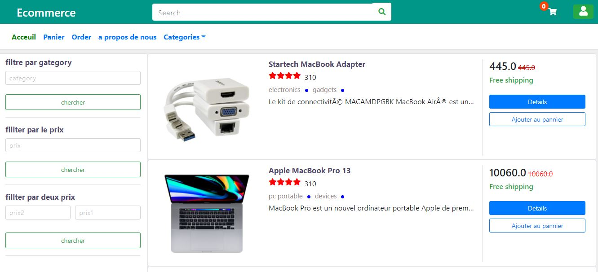

# java-EE-E-Commerce-Web-App
E-commerce web app: basic e-commerce workflow +registration with email verification + authentication using java ee Filters  + jboss wildfly 18 used to deploy the app
the application contains two main part : one is public for the client to perform different kind of operation and the other is for the administration

public interface :

login interfece

administration 

